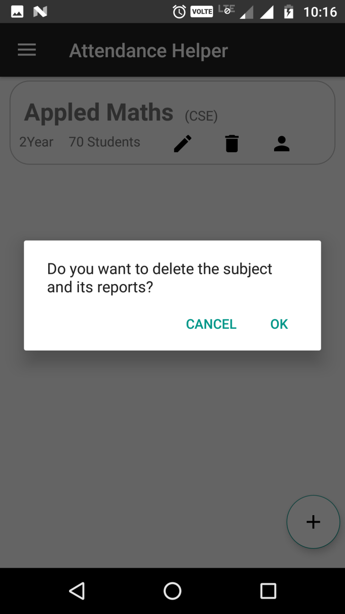

# AndroidAttendanceProject
Android Application project that i have build in kotlin below are the screenshots for that.
## WELCOME SCREEN                   
</a> 
## ADDING SUBJECT 
</a> 
</a> 
</a>
</a>
## SHOWING ADDED SUBJECTS 
</a>
## CHANGING THE STUDENT NAMES 
</a>
</a>
## TAKE ATTENDANCE 
</a>
</a>
## TIME AND DATE PICKERS FOR ATTENDANCE
</a>
</a>
## REPORT ACTIVITY
</a>
</a>
## DELETE REPORT
</a>
</a>
## EDIT SUBJECT ACTIVITY
</a>
</a>
</a>
</a>
## SCHEDULE ACTIVITY
</a>
</a>
## DELETE SUBJECT
</a>
</a>
